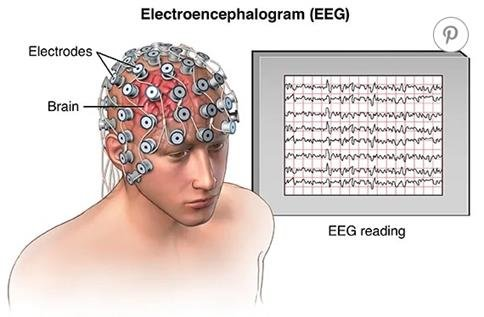
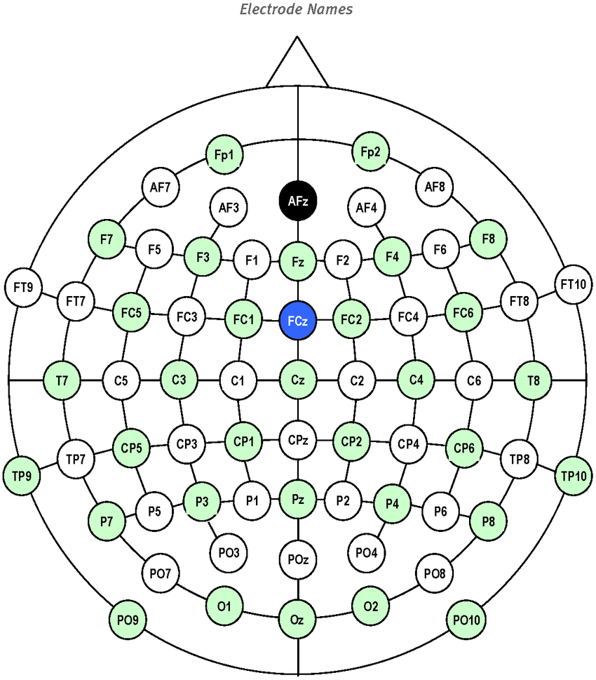
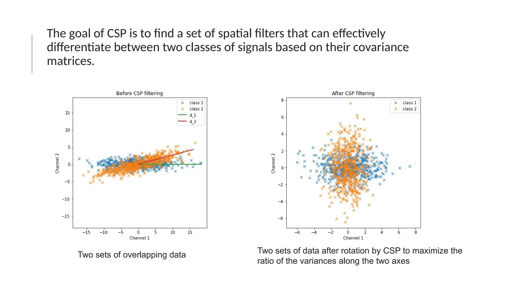

# Introduction

A brain-computer interface (BCI) system that classifies motor imagery and motor execution tasks from electroencephalographic (EEG) data using machine learning. The project implements a complete pipeline — from raw EEG signal loading and preprocessing to real-time classification — built on the PhysioNet EEG Motor Movement/Imagery Dataset (109 subjects, 64 channels). It uses Common Spatial Patterns (CSP) for spatial filtering and dimensionality reduction combined with Linear Discriminant Analysis (LDA) for classification, all wrapped in a scikit-learn Pipeline with cross-validated evaluation and a streaming playback mode that simulates real-time BCI inference.


## What is a BCI?

A brain-computer interface translates brain activity into commands that a computer can understand. The brain constantly produces electrical signals as neurons communicate. These signals can be measured non-invasively using electroencephalography (EEG) — electrodes placed on the scalp that record voltage fluctuations.

In a motor imagery BCI, a person imagines moving a body part (e.g., left hand, right hand, or feet) without actually moving it. Different imagined movements produce distinct patterns of brain activity, particularly over the motor cortex. A machine learning classifier can learn to distinguish these patterns and predict which movement the person is imagining, effectively allowing them to control a computer with their thoughts.

## What is EEG?

Electroencephalography (EEG) is a non-invasive neuroimaging technique that measures electrical activity in the brain by recording voltage fluctuations from electrodes placed on the scalp. These signals, typically in the microvolt range, reflect the synchronized activity of millions of neurons and contain oscillations at different frequency bands (delta, theta, alpha, mu, beta, and gamma) that correspond to various cognitive and motor states. EEG offers excellent temporal resolution (millisecond-scale) and is widely used in both clinical applications and research, particularly in brain-computer interfaces due to its portability, low cost, and ability to capture real-time neural dynamics associated with motor imagery, attention, and other cognitive processes.

<figure>
  
  <figcaption><em>Figure 1: EEG measurement process</em></figcaption>
</figure>

Electrodes are positioned on the scalp according to the International 10-20 system, a standardized layout based on measured distances between anatomical landmarks of the skull. Each electrode site is labeled with a letter indicating the brain region (F — frontal, C — central, P — parietal, O — occipital, T — temporal) and a number indicating laterality (odd numbers for the left hemisphere, even for the right, and "z" for the midline). For motor imagery tasks, the most relevant electrodes are those over the sensorimotor cortex, such as C3, Cz, and C4.

<figure>
  
  <figcaption><em>Figure 2: Standard EEG electrode placement (10-20 system)</em></figcaption>
</figure>


# Implementation

## EEG Data and Motor Imagery

### How to load data
```bash
aws s3 sync --no-sign-request s3://physionet-open/eegmmidb/1.0.0/ ./data
```


This project uses the [PhysioNet EEG Motor Movement/Imagery Dataset](https://physionet.org/content/eegmmidb/1.0.0/) containing recordings from 109 subjects, each performing 14 experimental runs with 64 EEG channels.

The key signal for motor imagery classification lies in the **mu rhythm** (8-12 Hz) and **beta band** (13-30 Hz). When a person imagines moving their left hand, the mu rhythm over the right motor cortex decreases (event-related desynchronization), and vice versa. By applying a bandpass filter (8-30 Hz) we isolate these discriminative frequency bands from the raw EEG signal, which contains noise, muscle artifacts, and irrelevant low-frequency drift.

## How This Project Works

### Processing Pipeline

```
Raw EDF files (PhysioNet)
    |
    v
Load with MNE, select 19 motor channels
    |
    v
Bandpass filter (8-30 Hz)
    |
    v
Extract epochs around task events
    |
    v
CSP (Common Spatial Patterns) — dimensionality reduction
    Input:  (n_trials, 19 channels, n_times)
    Output: (n_trials, 6 components)
    |
    v
LDA (Linear Discriminant Analysis) — classification
    Output: predicted class (e.g., left_fist vs right_fist)
```

### Common Spatial Patterns (CSP)

CSP is a spatial filtering technique that finds linear combinations of EEG channels maximizing the variance difference between two classes. It solves a generalized eigenvalue problem on the class-conditional covariance matrices, producing spatial filters that highlight the most discriminative brain activity patterns.

<figure>
  
  <figcaption><em>Figure 3: Visualization/Intuitoon behind Common Spatial Pattern algorithm</em></figcaption>
</figure>


Our CSP implementation (`src/csp.py`) is a custom sklearn-compatible transformer inheriting from `BaseEstimator` and `TransformerMixin`. It uses numpy/scipy for eigenvalue decomposition and covariance estimation, and integrates directly into an sklearn `Pipeline`.


### Training and Evaluation

Each subject gets their own model (within-subject evaluation — standard BCI practice, since EEG signals are highly subject-specific):

1. Load epochs for a subject and experiment type
2. Split 80% train / 20% test (stratified)
3. Run `cross_val_score` on the training set (5-fold CV)
4. Train on the full training set
5. Evaluate on the held-out test set

The full evaluation runs this across all 109 subjects and 4 experiment types:
- Motor Execution — Left/Right Hand
- Motor Imagery — Left/Right Hand
- Motor Execution — Hands/Feet
- Motor Imagery — Hands/Feet

### Real-Time Streaming Playback

The predict mode simulates real-time BCI inference. Instead of batch-predicting all epochs at once, it:

1. Loads a pre-trained pipeline from disk
2. Opens the raw EEG file and walks through events chronologically
3. For each event, extracts the epoch window from continuous data
4. Feeds it through the pipeline and outputs the prediction
5. Measures inference latency (must be < 2 seconds per epoch)

This satisfies the subject requirement of *"Playback reading on the file to simulate a data stream"* without using `mne-realtime`.

### Visualization

The visualization command produces before/after plots of EEG data to demonstrate the effect of bandpass filtering:
- **Signal plots**: Raw EEG time series vs filtered — the filtered signal is visibly cleaner
- **PSD plots** (optional): Power spectral density showing that only the 8-30 Hz band is preserved

## Project Structure

```
src/
  mybci.py              — CLI entry point (Click)
  pipeline.py           — Pipeline construction, training, model save/load
  data_loader.py        — EEG data loading from PhysioNet via MNE
  csp.py                — Custom CSP (BaseEstimator + TransformerMixin)
  constants.py          — Enums, channel lists, run mappings
  cli_commands/
    run.py              — Train and predict modes
    evaluate.py         — Full evaluation across subjects/experiments
    visualize.py        — Raw vs filtered EEG plotting
```

## Requirements Met

| Subject Requirement | Implementation |
|---|---|
| Parse and explore EEG data with MNE | `data_loader.py` loads PhysioNet EDF files, extracts epochs |
| Visualize raw data, filter, visualize again | `visualize` command: before/after signal + optional PSD plots |
| Implement dimensionality reduction | Custom CSP in `csp.py` with `BaseEstimator`/`TransformerMixin` |
| Use sklearn Pipeline object | CSP + LDA pipeline in `pipeline.py` |
| Classify a data stream in "real time" | Streaming playback in predict mode, < 2s latency per epoch |
| Script for training | `run -m train` with CV scores and test accuracy |
| Script for prediction | `run -m predict` with saved model and epoch-by-epoch output |
| cross_val_score on whole pipeline | Applied during training on the full pipeline |
| 60%+ mean accuracy across subjects | Evaluated via `evaluate` command across 109 subjects x 4 experiments |
| Do not use mne-realtime | Not used — playback implemented with manual epoch extraction |

## Quick Start

```bash
# Create and activate virtual environment
python3 -m venv .venv
source .venv/bin/activate

# Install dependencies
pip install -r requirements.txt

cd src

# Visualize raw vs filtered EEG
python mybci.py visualize -s 1 -t motor_imagery -p left_right_hand

# Train and save a model
python mybci.py run -s 1 -t motor_imagery -p left_right_hand -m train \
  --save-model --model-path models/S001_mi_lr.joblib

# Streaming prediction with saved model
python mybci.py run -s 1 -t motor_imagery -p left_right_hand -m predict \
  --model-path models/S001_mi_lr.joblib

# Full evaluation across all subjects
python mybci.py evaluate

# Evaluate a subset
python mybci.py evaluate --subjects 1-10 --verbose
```

See [CLI.md](CLI.md) for the full command reference.
